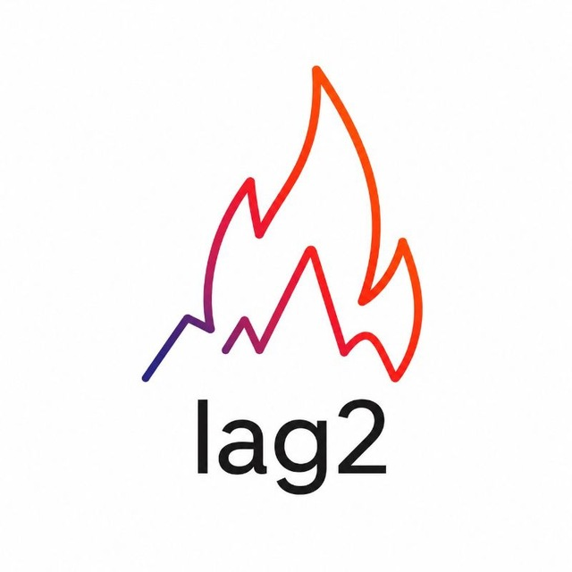

# LAG2 Interactive Course

Study linear algebra with interactive theory, visualizations, and a MATLAB-Lite lab.

| Use the course | Link |
| --- | --- |
| **Online — phone, tablet or computer** | [Open LAG2](https://asadbek31415-alt.github.io/lag2-course/) |
| **Offline on a computer** | [Download LAG2-Interactive-Course.zip](https://github.com/asadbek31415-alt/lag2-course/releases/latest/download/LAG2-Interactive-Course.zip) |
| **Offline on Android (optional)** | [Download LAG2-Android.apk](https://github.com/asadbek31415-alt/lag2-course/releases/latest/download/LAG2-Android.apk) |

Current course version: **v0.1.0**. [Changes and all downloads](https://github.com/asadbek31415-alt/lag2-course/releases/latest).

For the computer ZIP, extract the whole folder, then open index.html. For Android, download the APK and allow installation from the browser when Android asks. The online link needs internet. The offline downloads include equations, calculations and local animations; YouTube and the exam channel need internet.

Topics: functions and numerical errors; interpolation; LU factorization; QR and eigenvalues; singular value decomposition.

MATLAB-Lite implements a course-focused subset of MATLAB; it is not the official MATLAB product. Use the Nav, Theory and MATLAB tabs on smaller screens.

## Updates

The online link stays the same. Refresh after a release. Downloaded ZIPs and apps need a new download; the Android package preserves its app ID and signing key for updates. Returning website visitors see a compact version notice. GitHub users can choose Watch → Custom → Releases for release notifications.

## Publishing

One reviewed version tag builds the website, computer ZIP and signed Android APK from the same source. See PUBLISHING.md. Third-party notices are in site/THIRD_PARTY_NOTICES.md.
